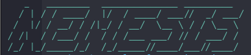

# Nemesis - Dark Web Crawler



Nemesis is a Python-based dark web crawler for .onion sites, designed to crawl Tor hidden services, save HTML content, and filter pages by keywords. It uses Tor for anonymity, MongoDB for storage, and supports concurrent crawling with system resource monitoring.

## Features

- Crawls .onion websites via Tor proxy
- Saves HTML content and extracted links to MongoDB and local files
- Filters pages by keyword (e.g., crypto)
- Configurable output directories (e.g., crypto_1)
- System resource monitoring to prevent overload

## Prerequisites

- Linux (e.g., Kali, Ubuntu)
- Tor (socks5://127.0.0.1:9050)
- MongoDB
- Python 3.8+
- Git

## Installation

1. **Clone the Repository:**
   ```
   git clone https://github.com/PriyanshuDubey2115/Nemesis.git
   ```

2. **Get inside the 'Nemesis directory':**
   ```
   cd Nemesis
   ```

3. **Automate the installation of all the required services and packages by running the setup script:**
   ```
   chmod +x setup.sh
   ./setup.sh
   ```
   
   This installs dependencies, sets up a virtual environment, and configures the nemesis command globally.

4. **Verify Installation:**
   ```
   nemesis -h
   ```

## Usage

Run Nemesis with optional arguments:
```
nemesis -k <keyword> -t <time_in_minutes> -s <start_url> -o <output_dir>
```

### Arguments:
- `-k, --keyword`: Filter pages containing the keyword (e.g., crypto)
- `-t, --time`: Crawl duration in minutes (10–180, default: 30)
- `-s, --start-url`: Starting .onion URL (e.g., http://example.onion)
- `-o, --output-dir`: Output directory (creates <keyword>_<number> subdirectory)

### Example:
```
nemesis -k crypto -t 10 -s http://example.onion -o ~/Downloads/test
```

Output is saved to `~/Downloads/test/crypto_1/` (e.g., queue.txt, visited_links.txt, keyword_matches.txt, crawler.log, raw_pages/).

## Troubleshooting

### Tor/MongoDB not running:
```
sudo systemctl start tor
sudo systemctl start mongodb
sudo systemctl status tor
sudo systemctl status mongodb
```

### Permission issues:
```
chmod -R u+w ~/Downloads/test
```

### Dependencies:
Ensure all Python dependencies are installed:
```
pip install -r requirements.txt
```

## Development

### Directory Structure:
- `nemesis.py`: Main crawler script
- `setup.sh`: Installation script
- `requirements.txt`: Python dependencies

### Contributing:
Fork the repository, make changes, and submit a pull request.

## License

MIT License. See LICENSE for details.

## Contact

- **GitHub**: PriyanshuDubey2115 & manuav007
- **Issues**: Report bugs or feature requests
